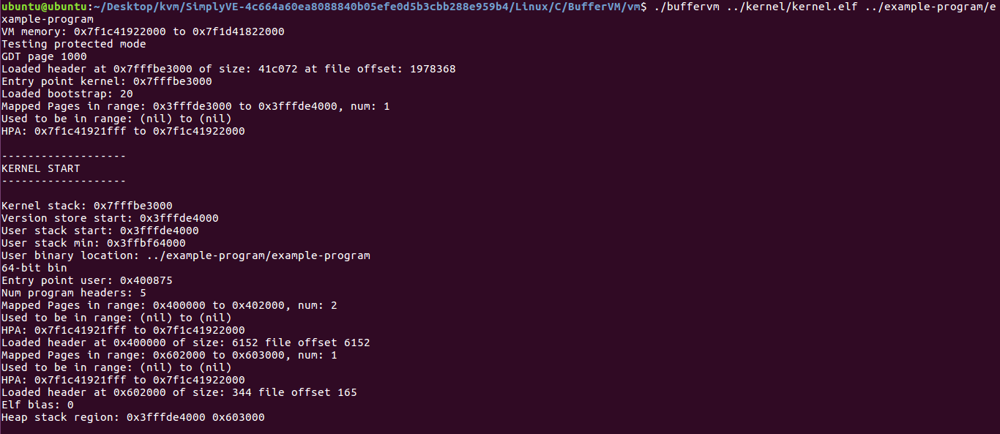

  

## 项目结构

  SimplyVE主要阅读Linux/C/BufferVM目录下的源码,文件结构的意义如下:

```
BufferVM
|--bootstrap (BootLoader)
|--common (KVM虚拟机功能实现与头文件)
|--example-program (应用层示例执行程序)
|--host_kernel (KVM vmcall内核执行模块)
|--intelxed (第三方库安装目录)
|--kernel (简易内核)
|--libc (libc库文件)
|--vm (KVM虚拟机实现逻辑)

```

  BufferVM的编译过程有些复杂,首先第一步需要下载intelxed库

```sh
cd intelxed
git clone https://github.com/intelxed/mbuild.git
git clone https://github.com/intelxed/xed
```

  准备好第三方库之后,回到BufferVM目录下,进行cmake,在编译这里有一点**非常关键**,就是要尽可能使用C++ 11标准的编译器编译(比如gcc 主版本号<= 6),如果这一步没有选对编译器会遇到两处源码编译报错问题(原因是高版本的C++标注不允许这么写).

```
fuzzing@fuzzing-virtual-machine:~/Desktop/vm_learn/SimplyVE-4c664a60ea8088840b05efe0d5b3cbb288e959b4/Linux/C/BufferVM$ cmake .
CMake Warning (dev) in CMakeLists.txt:
  No project() command is present.  The top-level CMakeLists.txt file must
  contain a literal, direct call to the project() command.  Add a line of
  code such as

    project(ProjectName)

  near the top of the file, but after cmake_minimum_required().

  CMake is pretending there is a "project(Project)" command on the first
  line.
This warning is for project developers.  Use -Wno-dev to suppress it.

-- Configuring done
-- Generating done
-- Build files have been written to: /home/fuzzing/Desktop/vm_learn/SimplyVE-4c664a60ea8088840b05efe0d5b3cbb288e959b4/Linux/C/BufferVM
fuzzing@fuzzing-virtual-machine:~/Desktop/vm_learn/SimplyVE-4c664a60ea8088840b05efe0d5b3cbb288e959b4/Linux/C/BufferVM$ make
make[1]: Entering directory '/home/fuzzing/Desktop/vm_learn/SimplyVE-4c664a60ea8088840b05efe0d5b3cbb288e959b4/Linux/C/BufferVM'
make[2]: Entering directory '/home/fuzzing/Desktop/vm_learn/SimplyVE-4c664a60ea8088840b05efe0d5b3cbb288e959b4/Linux/C/BufferVM'
make[2]: Leaving directory '/home/fuzzing/Desktop/vm_learn/SimplyVE-4c664a60ea8088840b05efe0d5b3cbb288e959b4/Linux/C/BufferVM'
[ 52%] Built target bootstrap.o
make[2]: Entering directory '/home/fuzzing/Desktop/vm_learn/SimplyVE-4c664a60ea8088840b05efe0d5b3cbb288e959b4/Linux/C/BufferVM'
make[2]: Leaving directory '/home/fuzzing/Desktop/vm_learn/SimplyVE-4c664a60ea8088840b05efe0d5b3cbb288e959b4/Linux/C/BufferVM'
[ 52%] Built target bootstrap
make[2]: Entering directory '/home/fuzzing/Desktop/vm_learn/SimplyVE-4c664a60ea8088840b05efe0d5b3cbb288e959b4/Linux/C/BufferVM'
make[2]: Leaving directory '/home/fuzzing/Desktop/vm_learn/SimplyVE-4c664a60ea8088840b05efe0d5b3cbb288e959b4/Linux/C/BufferVM'
[ 52%] Built target intelxed
make[2]: Entering directory '/home/fuzzing/Desktop/vm_learn/SimplyVE-4c664a60ea8088840b05efe0d5b3cbb288e959b4/Linux/C/BufferVM'
make[2]: Leaving directory '/home/fuzzing/Desktop/vm_learn/SimplyVE-4c664a60ea8088840b05efe0d5b3cbb288e959b4/Linux/C/BufferVM'
[ 52%] Built target c
make[2]: Entering directory '/home/fuzzing/Desktop/vm_learn/SimplyVE-4c664a60ea8088840b05efe0d5b3cbb288e959b4/Linux/C/BufferVM'
make[2]: Leaving directory '/home/fuzzing/Desktop/vm_learn/SimplyVE-4c664a60ea8088840b05efe0d5b3cbb288e959b4/Linux/C/BufferVM'
make[2]: Entering directory '/home/fuzzing/Desktop/vm_learn/SimplyVE-4c664a60ea8088840b05efe0d5b3cbb288e959b4/Linux/C/BufferVM'
[ 52%] Linking C executable kernel.elf
Error running link command: Permission denied
make[2]: *** [kernel/CMakeFiles/kernel.dir/build.make:375: kernel/kernel.elf] Error 2
make[2]: Leaving directory '/home/fuzzing/Desktop/vm_learn/SimplyVE-4c664a60ea8088840b05efe0d5b3cbb288e959b4/Linux/C/BufferVM'
make[1]: *** [CMakeFiles/Makefile2:277: kernel/CMakeFiles/kernel.dir/all] Error 2
make[1]: Leaving directory '/home/fuzzing/Desktop/vm_learn/SimplyVE-4c664a60ea8088840b05efe0d5b3cbb288e959b4/Linux/C/BufferVM'
make: *** [Makefile:84: all] Error 2
fuzzing@fuzzing-virtual-machine:~/Desktop/vm_learn/SimplyVE-4c664a60ea8088840b05efe0d5b3cbb288e959b4/Linux/C/BufferVM$ 
```

  注意,上面的编译过程中有提示到`Error running link command: Permission denied`这个错误,这是因为链接的时候产生了错误.笔者阅读了一下kernel/CMakeLists.txt的源码,发现链接生成内核时会调用kernel/linker.py文件去执行链接.编译链接出错的日志文件记录在kernel/CMakeFiles/kernel.dir/link.txt下,输出文件内容,我们就可以看到调用方法了.

```sh
fuzzing@fuzzing-virtual-machine:~/Desktop/vm_learn/SimplyVE-4c664a60ea8088840b05efe0d5b3cbb288e959b4/Linux/C/BufferVM$ cat kernel/CMakeFiles/kernel.dir/link.txt 
/home/fuzzing/Desktop/vm_learn/SimplyVE-4c664a60ea8088840b05efe0d5b3cbb288e959b4/Linux/C/BufferVM/kernel/linker.py -c ' -static -no-pie -Wall -Wextra -Werror -Wno-unused-parameter -Wno-switch -Wno-unused-variable -Wno-return-type -Wno-old-style-declaration -Wno-override-init -ffreestanding -fPIC -mcmodel=large -mno-red-zone -mno-mmx -mno-sse -mno-sse2 -nostdlib -lgcc -fdata-sections -ffunction-sections' -l '-Wl,--gc-sections,--build-id=none,--no-dynamic-linker -rdynamic' -L ' ../libc/libc.a ../intelxed/kit/lib/libxed.a ' -s /home/fuzzing/Desktop/vm_learn/SimplyVE-4c664a60ea8088840b05efe0d5b3cbb288e959b4/Linux/C/BufferVM/kernel/kernel.ld -o 'CMakeFiles/kernel.dir/asm/start.S.o CMakeFiles/kernel.dir/c/kernel.c.o CMakeFiles/kernel.dir/asm/host.S.o CMakeFiles/kernel.dir/c/idt.c.o CMakeFiles/kernel.dir/c/gdt.c.o CMakeFiles/kernel.dir/asm/idt.S.o CMakeFiles/kernel.dir/asm/page_fault.S.o CMakeFiles/kernel.dir/c/cstubs.c.o CMakeFiles/kernel.dir/asm/tss.S.o CMakeFiles/kernel.dir/c/tss.c.o CMakeFiles/kernel.dir/c/syscall.c.o CMakeFiles/kernel.dir/asm/syscall.S.o CMakeFiles/kernel.dir/asm/cpu.S.o CMakeFiles/kernel.dir/c/version.c.o CMakeFiles/kernel.dir/__/common/vma.c.o CMakeFiles/kernel.dir/c/mmap.c.o CMakeFiles/kernel.dir/c/stack.c.o CMakeFiles/kernel.dir/c/page_fault.c.o CMakeFiles/kernel.dir/c/utils.c.o CMakeFiles/kernel.dir/c/vma_heap.c.o CMakeFiles/kernel.dir/c/elf.c.o CMakeFiles/kernel.dir/c/cpu.c.o CMakeFiles/kernel.dir/c/rbtree.c.o CMakeFiles/kernel.dir/c/vma.c.o' -t kernel.elf
```

  找到链接命令后,进入kernel目录,手工生成一下

```sh
fuzzing@fuzzing-virtual-machine:~/Desktop/vm_learn/SimplyVE-4c664a60ea8088840b05efe0d5b3cbb288e959b4/Linux/C/BufferVM$ cd kernel/
fuzzing@fuzzing-virtual-machine:~/Desktop/vm_learn/SimplyVE-4c664a60ea8088840b05efe0d5b3cbb288e959b4/Linux/C/BufferVM/kernel$ ls
asm  c  CMakeFiles  cmake_install.cmake  CMakeLists.txt  h  kernel.ld  linker.py  Makefile  script.ld  sections.map
fuzzing@fuzzing-virtual-machine:~/Desktop/vm_learn/SimplyVE-4c664a60ea8088840b05efe0d5b3cbb288e959b4/Linux/C/BufferVM/kernel$ python3 /home/fuzzing/Desktop/vm_learn/SimplyVE-4c664a60ea8088840b05efe0d5b3cbb288e959b4/Linux/C/BufferVM/kernel/linker.py -c ' -static -no-pie -Wall -Wextra -Werror -Wno-unused-parameter -Wno-switch -Wno-unused-variable -Wno-return-type -Wno-old-style-declaration -Wno-override-init -ffreestanding -fPIC -mcmodel=large -mno-red-zone -mno-mmx -mno-sse -mno-sse2 -nostdlib -lgcc -fdata-sections -ffunction-sections' -l '-Wl,--gc-sections,--build-id=none,--no-dynamic-linker -rdynamic' -L ' ../libc/libc.a ../intelxed/kit/lib/libxed.a ' -s /home/fuzzing/Desktop/vm_learn/SimplyVE-4c664a60ea8088840b05efe0d5b3cbb288e959b4/Linux/C/BufferVM/kernel/kernel.ld -o 'CMakeFiles/kernel.dir/asm/start.S.o CMakeFiles/kernel.dir/c/kernel.c.o CMakeFiles/kernel.dir/asm/host.S.o CMakeFiles/kernel.dir/c/idt.c.o CMakeFiles/kernel.dir/c/gdt.c.o CMakeFiles/kernel.dir/asm/idt.S.o CMakeFiles/kernel.dir/asm/page_fault.S.o CMakeFiles/kernel.dir/c/cstubs.c.o CMakeFiles/kernel.dir/asm/tss.S.o CMakeFiles/kernel.dir/c/tss.c.o CMakeFiles/kernel.dir/c/syscall.c.o CMakeFiles/kernel.dir/asm/syscall.S.o CMakeFiles/kernel.dir/asm/cpu.S.o CMakeFiles/kernel.dir/c/version.c.o CMakeFiles/kernel.dir/__/common/vma.c.o CMakeFiles/kernel.dir/c/mmap.c.o CMakeFiles/kernel.dir/c/stack.c.o CMakeFiles/kernel.dir/c/page_fault.c.o CMakeFiles/kernel.dir/c/utils.c.o CMakeFiles/kernel.dir/c/vma_heap.c.o CMakeFiles/kernel.dir/c/elf.c.o CMakeFiles/kernel.dir/c/cpu.c.o CMakeFiles/kernel.dir/c/rbtree.c.o CMakeFiles/kernel.dir/c/vma.c.o' -t kernel.elf
cpp -x c -undef -USECOND_LINK /home/fuzzing/Desktop/vm_learn/SimplyVE-4c664a60ea8088840b05efe0d5b3cbb288e959b4/Linux/C/BufferVM/kernel/kernel.ld -o script.ld && sed -i '/^\s*#/d' script.ld
cc1: fatal error: opening output file script.ld: Permission denied
compilation terminated.
gcc CMakeFiles/kernel.dir/asm/start.S.o CMakeFiles/kernel.dir/c/kernel.c.o CMakeFiles/kernel.dir/asm/host.S.o CMakeFiles/kernel.dir/c/idt.c.o CMakeFiles/kernel.dir/c/gdt.c.o CMakeFiles/kernel.dir/asm/idt.S.o CMakeFiles/kernel.dir/asm/page_fault.S.o CMakeFiles/kernel.dir/c/cstubs.c.o CMakeFiles/kernel.dir/asm/tss.S.o CMakeFiles/kernel.dir/c/tss.c.o CMakeFiles/kernel.dir/c/syscall.c.o CMakeFiles/kernel.dir/asm/syscall.S.o CMakeFiles/kernel.dir/asm/cpu.S.o CMakeFiles/kernel.dir/c/version.c.o CMakeFiles/kernel.dir/__/common/vma.c.o CMakeFiles/kernel.dir/c/mmap.c.o CMakeFiles/kernel.dir/c/stack.c.o CMakeFiles/kernel.dir/c/page_fault.c.o CMakeFiles/kernel.dir/c/utils.c.o CMakeFiles/kernel.dir/c/vma_heap.c.o CMakeFiles/kernel.dir/c/elf.c.o CMakeFiles/kernel.dir/c/cpu.c.o CMakeFiles/kernel.dir/c/rbtree.c.o CMakeFiles/kernel.dir/c/vma.c.o  -static -no-pie -Wall -Wextra -Werror -Wno-unused-parameter -Wno-switch -Wno-unused-variable -Wno-return-type -Wno-old-style-declaration -Wno-override-init -ffreestanding -fPIC -mcmodel=large -mno-red-zone -mno-mmx -mno-sse -mno-sse2 -nostdlib -lgcc -fdata-sections -ffunction-sections -Wl,--gc-sections,--build-id=none,--no-dynamic-linker -rdynamic -T script.ld -Xlinker -Map=sections.map  ../libc/libc.a ../intelxed/kit/lib/libxed.a  -o /dev/null
/usr/bin/ld: cannot open linker script file script.ld: No such file or directory
collect2: error: ld returned 1 exit status
cpp -x c -undef -DSECOND_LINK -DBINARY_SIZE=0x4f9000 /home/fuzzing/Desktop/vm_learn/SimplyVE-4c664a60ea8088840b05efe0d5b3cbb288e959b4/Linux/C/BufferVM/kernel/kernel.ld script.ld && sed -i '/^\s*#/d' script.ld
gcc CMakeFiles/kernel.dir/asm/start.S.o CMakeFiles/kernel.dir/c/kernel.c.o CMakeFiles/kernel.dir/asm/host.S.o CMakeFiles/kernel.dir/c/idt.c.o CMakeFiles/kernel.dir/c/gdt.c.o CMakeFiles/kernel.dir/asm/idt.S.o CMakeFiles/kernel.dir/asm/page_fault.S.o CMakeFiles/kernel.dir/c/cstubs.c.o CMakeFiles/kernel.dir/asm/tss.S.o CMakeFiles/kernel.dir/c/tss.c.o CMakeFiles/kernel.dir/c/syscall.c.o CMakeFiles/kernel.dir/asm/syscall.S.o CMakeFiles/kernel.dir/asm/cpu.S.o CMakeFiles/kernel.dir/c/version.c.o CMakeFiles/kernel.dir/__/common/vma.c.o CMakeFiles/kernel.dir/c/mmap.c.o CMakeFiles/kernel.dir/c/stack.c.o CMakeFiles/kernel.dir/c/page_fault.c.o CMakeFiles/kernel.dir/c/utils.c.o CMakeFiles/kernel.dir/c/vma_heap.c.o CMakeFiles/kernel.dir/c/elf.c.o CMakeFiles/kernel.dir/c/cpu.c.o CMakeFiles/kernel.dir/c/rbtree.c.o CMakeFiles/kernel.dir/c/vma.c.o  -static -no-pie -Wall -Wextra -Werror -Wno-unused-parameter -Wno-switch -Wno-unused-variable -Wno-return-type -Wno-old-style-declaration -Wno-override-init -ffreestanding -fPIC -mcmodel=large -mno-red-zone -mno-mmx -mno-sse -mno-sse2 -nostdlib -lgcc -fdata-sections -ffunction-sections -Wl,--gc-sections,--build-id=none,--no-dynamic-linker -rdynamic -T script.ld  ../libc/libc.a ../intelxed/kit/lib/libxed.a  -o kernel.elf
fuzzing@fuzzing-virtual-machine:~/Desktop/vm_learn/SimplyVE-4c664a60ea8088840b05efe0d5b3cbb288e959b4/Linux/C/BufferVM/kernel$ ls
asm  c  CMakeFiles  cmake_install.cmake  CMakeLists.txt  h  kernel.elf  kernel.ld  linker.py  Makefile  script.ld  sections.map
```

  编译成功之后,我们进入到BufferVM/vm目录启动测试.

````sh
cd vm
./buffervm ../kernel/kernel.elf ../example-program.example-program
````

  启动成功之后就可以看到以下输出.




## 虚拟机启动过程分析

  上一章只是简单地提到KVM的接口如何被调用,有一些细节技术仍然没有深入探讨,在阅读BufferVM的代码中又学习到不少新知识,接下来一步一步来从虚拟机启动步骤分析.

  BufferVM的入口点目录在vm/main.c文件中,main()函数初始化从KVM中创建的虚拟机后vcpu之后就进入kernel了.

```c

struct vm_t vm;

int main(int argc, char *argv[], char *envp[]) {
    if (argc < 3) {
        fprintf(stderr, "%s kernel.elf binary\n", argv[0]);
        return 1;
    }

    int kernel_binary_fd;
    if (!(kernel_binary_fd = read_binary(argv[1]))) {  //  获取kernel.elf的内容
        return 1;
    }

    struct vcpu_t vcpu;

    vm_init(&vm, PHYSICAL_HEAP_SIZE);  //  初始化kvm
    vcpu_init(&vm, &vcpu);  //  初始化cpu

    run(&vm, &vcpu, kernel_binary_fd, argc - 2, &argv[2], envp);

    close(kernel_binary_fd);

    return 0;
}

static size_t phy_mem_size;

void vm_init(struct vm_t *vm, size_t mem_size)
{
    int api_ver;
    struct kvm_userspace_memory_region memreg;

    phy_mem_size = mem_size;

    vm->sys_fd = open("/dev/kvm", O_RDWR);  //  打开KVM
    api_ver = ioctl(vm->sys_fd, KVM_GET_API_VERSION, 0);  //  获取KVM版本信息
    vm->fd = ioctl(vm->sys_fd, KVM_CREATE_VM, 0);  //  创建虚拟机
    vm->mem = mmap(NULL, mem_size, PROT_READ | PROT_WRITE,
                   MAP_PRIVATE | MAP_ANONYMOUS | MAP_NORESERVE, -1, 0);  //  创建物理内存

    madvise(vm->mem, mem_size, MADV_MERGEABLE);  //  参考:https://www.cnblogs.com/muhe221/articles/5346116.html

    memreg.slot = 0;
    memreg.flags = 0;
    memreg.guest_phys_addr = 0;
    memreg.memory_size = mem_size;
    memreg.userspace_addr = (unsigned long)vm->mem;
    if (ioctl(vm->fd, KVM_SET_USER_MEMORY_REGION, &memreg) < 0) {  //  映射分配的内存到VM中
        perror("KVM_SET_USER_MEMORY_REGION");
        exit(1);
    }
}

void vcpu_init(struct vm_t *vm, struct vcpu_t *vcpu)
{
    int vcpu_mmap_size;

    vcpu->fd = ioctl(vm->fd, KVM_CREATE_VCPU, 0);  //  创建VCPU对象

    ioctl(vm->fd, KVM_SET_TSS_ADDR, TSS_KVM);  //  TSS是指任务状态段,它与中断和状态执行状态切换有关
    //  参考链接:
    //   https://www.kernel.org/doc/Documentation/virtual/kvm/api.txt
    //   https://www.lse.epita.fr/teaching/epita/x86-part3.pdf
    //   https://stackoverflow.com/questions/54845547/problem-switching-to-v8086-mode-from-32-bit-protected-mode-by-setting-eflags-vm
    //   https://www.cs.umd.edu/~hollings/cs412/s02/proj1/ia32ch7.pdf
    //   https://en.wikipedia.org/wiki/Task_state_segment

    vcpu_mmap_size = ioctl(vm->sys_fd, KVM_GET_VCPU_MMAP_SIZE, 0);  //  获取VCPU的信息

    vcpu->kvm_run = mmap(NULL, vcpu_mmap_size, PROT_READ | PROT_WRITE,
                         MAP_SHARED, vcpu->fd, 0);
}
```

  经过这两步初始化后,接下来就是对CPU内部进行一系列的初始化了,这一阶段主要是为了跳转到内核做准备.

```c

void run(struct vm_t *vm, struct vcpu_t *vcpu, int kernel_binary_fd, int argc, char *argv[], char *envp[])
{
    struct kvm_sregs sregs;
    struct kvm_regs regs;

    printf("Testing protected mode\n");

    if (ioctl(vcpu->fd, KVM_GET_SREGS, &sregs) < 0) {  //  获取CPU特殊寄存器
        //  参考链接https://zh.wikipedia.org/wiki/%E5%AF%84%E5%AD%98%E5%99%A8
        perror("KVM_GET_SREGS");
        exit(1);
    }

    setup_long_mode(vm, &sregs);  //  初始化x64执行环境

```

  为CPU初始化长模式的过程比较复杂,大致过程是初始化页表->启用保护模式->初始化GDT表->启用物理地址拓展->启用写保护/内存对齐检查/拓展数学寄存器->在GDT表中设置对应的内存权限

```c

static void setup_long_mode(struct vm_t *vm, struct kvm_sregs *sregs) {
    struct kvm_segment seg = {
            .base = 0,
            .limit = 0xffffffff,
            .present = 1,
            .dpl = 0,
            .db = 1,
            .s = 1, /* Code/data */
            .l = 0,
            .g = 1, /* 4KB granularity */
    };
    uint64_t *gdt;

    build_page_tables(vm->mem);  //  初始化内存页表

    //Page for bootstrap
    map_physical_pages(0x0000, 0x0000, PDE64_WRITEABLE | PDE64_USER, 1, 0);
    //Page for gdt
    int64_t gdt_page = map_physical_pages(0x1000, 0x1000, PDE64_WRITEABLE | PDE64_USER, 1, 0);
    printf("GDT page %" PRIx64 "\n", gdt_page);

    sregs->cr0 |= CR0_PE; /* enter protected mode */
    sregs->gdt.base = gdt_page;
    sregs->cr3 = pml4_addr;
    sregs->cr4 = CR4_PAE | CR4_OSFXSR | CR4_OSXMMEXCPT;
    sregs->cr0 = CR0_PE | CR0_MP | CR0_ET | CR0_NE | CR0_WP | CR0_AM;
    sregs->efer = EFER_LME | EFER_NXE;
    //  参考链接:https://en.wikipedia.org/wiki/Control_register

    gdt = (void *) (vm->mem + gdt_page);
    /* gdt[0] is the null segment */

    gdt[0] = 0xDEADBEEF;

    //32-bit code segment - needed for bootstrap
    sregs->gdt.limit = 3 * 8 - 1;

    seg.type = 11; /* Code: execute, read, accessed */
    seg.selector = 0x08;
    fill_segment_descriptor(gdt, &seg);
    sregs->cs = seg;

    //64-bit stuff
    sregs->gdt.limit = 18 * 8 - 1;
    seg.l = 1;

    //64-bit kernel code segment
    seg.type = 11; /* Code: execute, read, accessed */
    seg.selector = 0x10;
    seg.db = 0;
    fill_segment_descriptor(gdt, &seg);

    //64-bit kernel data segment
    seg.type = 3; /* Data: read/write, accessed */
    seg.selector = 0x18;
    fill_segment_descriptor(gdt, &seg);

    sregs->ds = sregs->es = sregs->fs = sregs->ss = seg;


    seg.dpl = 3;
    seg.db = 0;

    //64-bit user data segment
    seg.type = 3; /* Data: read/write, accessed */
    seg.selector = 0x28;
    fill_segment_descriptor(gdt, &seg);

    //64-bit user code segment
    seg.type = 11; /* Code: execute, read, accessed */
    seg.selector = 0x30;
    fill_segment_descriptor(gdt, &seg);

    //64-bit cpu kernel data segment
    /*seg.selector = 0x50;
    seg.type = 19;
    //one for each cpu in future!
    seg.limit = sizeof(cpu_t) - 1;
    seg.base = CPU_START-0x1000;
    seg.s = 0;
    seg.dpl = 0;
    seg.present = 1;
    seg.avl = 0;
    seg.l = 1;
    seg.db = 0;
    seg.g = 0;
    fill_segment_descriptor(gdt, &seg);*/

}
```

